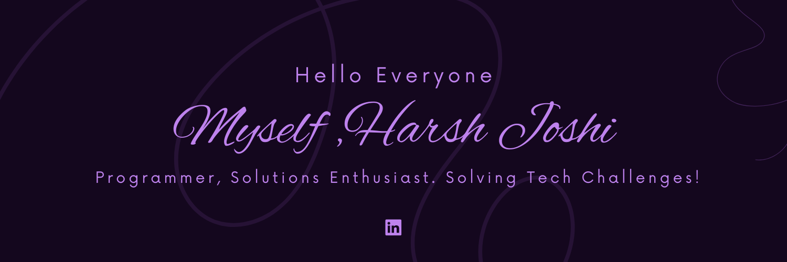

<h3 align="center">Machine Learning | Data Science | Full Stack development </h3>

<h4 align="center">I am a tech enthusiast and M.Sc. in AI candidate with a background in Information Technology. Currently exploring the fascinating domains of transformers and deep learning, I have a strong foundation in full-stack Ml development, with a special affinity for frontend design.</h4>

 

## ⚡️ A Few Quick Facts

- 🔭 I’m currently Looking for internship opportunites in domain of full stack development and machine learning**
-   I enjoy working on
  - 📊 Machine Learning & Data Science
  - 🖼 Computer Vision
  - 🛠 Full stack web devlopment
  - 🤖 AWS (Cloud computing)
- 📝 I write technical blogs and articles
- 👯 I’m looking to collaborate on making gen ai based projects
- 💬 Ask me about Python, ML, DL, NLP , Full stack development
- 📙 Check out my [Resume](./overview-readme/Harsh_joshi_ML.pdf)
- 🎉 Fun-Fact: I ❤️ Chess and Cricket and watch a lot web series🎬

## ⚡ Technologies

#### ML/DL

&nbsp;
&nbsp;
&nbsp;
&nbsp;
&nbsp;

## Connect with me:

 

